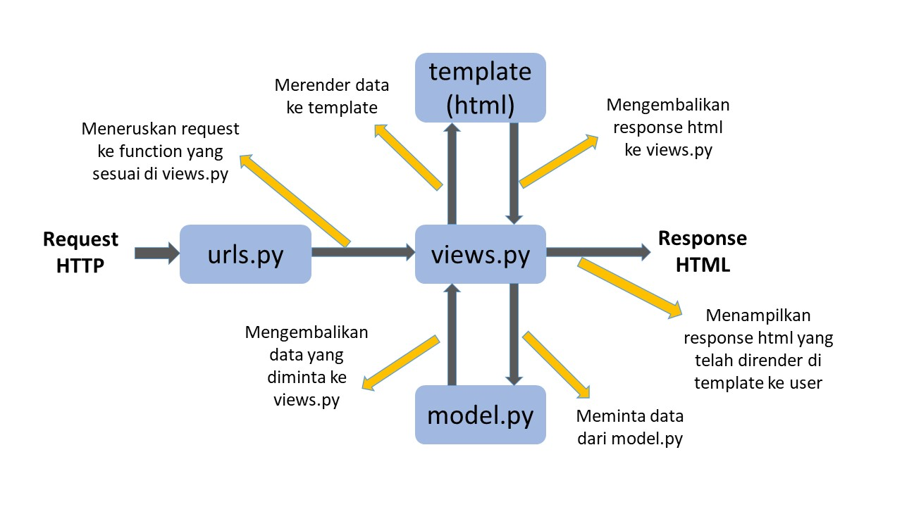

# Link App Heroku
<https://pbp-kd-tugas.herokuapp.com/katalog/>

# A. Buatlah bagan yang berisi request client ke web aplikasi berbasis Django beserta responnya dan jelaskan pada bagan tersebut kaitan antara urls.py, views.py, models.py, dan berkas html;

# B. Jelaskan kenapa menggunakan virtual environment? Apakah kita tetap dapat membuat aplikasi web berbasis Django tanpa menggunakan virtual environment?
Pembuatan aplikasi web berbasis Django bisa dilakukan tanpa menggunakan virtual environment. Namun, hal ini bisa membuat konflik package bila mengerjakan beberapa proyek. Virtual environment digunakan untuk memisahkan dan mengisolasi masing-masing proyek untuk menghindari terjadinya konflik tersebut. Penginstalan package dilakukan pada masing-masing virtual environment dan tidak secara global sehingga tiap virtual environment tidak mempengaruhi satu sama lain.

# C. Jelaskan bagaimana cara kamu mengimplementasikan poin 1 sampai dengan 4 di atas.

## Poin 1
1. Import data `CatalogItem` dari `models.py`
2. Membuat fungsi `show_katalog` yang menerima parameter `request` dari `urls.py` yang akan mengembalikan function `render` dengan parameter `request`, `"katalog.html"`, dan `context`
3. `context` merupakan dictionary yang berisi key-value pair untuk variabel `nama`, `npm`, dan `item_list`
4. `item_list` diassign nilai variabel `data_item_katalog` yang merupakan hasil QuerySet dari `CatalogItem.objects.all()`

## Poin 2
1. Import function `path` dari module `django.urls` dan `show_katalog` dari `views.py`
2. Membuat variabel `app_name` dan `urlpatterns`
3. Variabel `app_name` memiliki nilai berupa nama dari aplikasi, yaitu `"katalog"`
4. Variabel `urlpatterns` merupakan list yang berisikan function `path` dengan argumen `""`, `show_katalog`, `name = "show_katalog"`

## Poin 3
1. Mengganti `Fill me!` dengan variabel pada yang sesuai dengan `context` yang diberikan `views.py`, yaitu `nama` dan `npm`
2. Membuat loop yang mengisi data tabel dengan tiap iterasi mengisi satu baris tabel menggunakan data pada `item_list` yang diberikan `views.py`

## Poin 4
1. Menambahkan function `path` dengan argumen `"katalog/"` dan `include("katalog.urls")` pada variabel `urlpatterns` yang berada dalam `urls.py` di folder `project_django`
2. Membuat variabel repository secret berupa `HEROKU_APP_NAME` yang berisi nama app yang ingin dideploy dan `HEROKU_API_KEY` yang berisi API key akun Heroku
3. Add, commit, dan push file ke repository di github