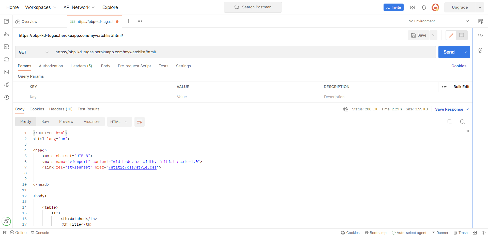
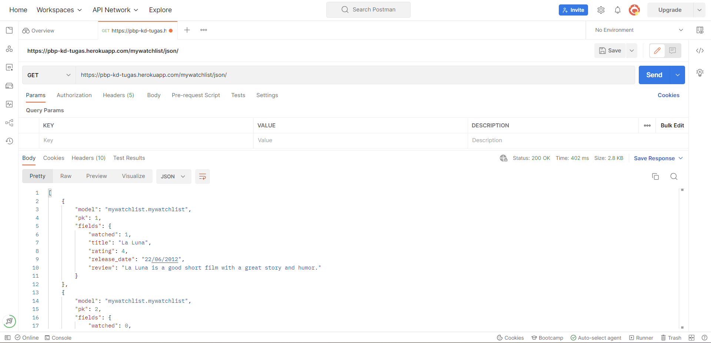
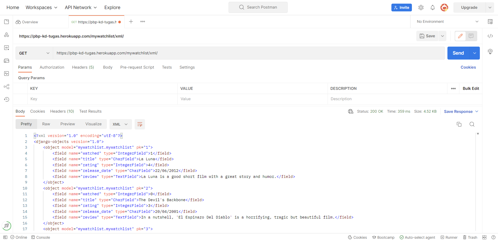

# Link App Heroku
<https://pbp-kd-tugas.herokuapp.com/mywatchlist/>

# A. Jelaskan perbedaan antara JSON, XML, dan HTML!

## HTML
HTML merupakan suatu Markup Language yang menggunakan tag untuk menentukan struktur tampilannya. Sintaksisnya adalah `<start_tag>` `element content` `</end_tag>`. Element pada HTML bisa memiliki atribut tambahan yang diletakkan pada `start_tag`.

## XML
XML merupakan suatu Markup Language seperti HTML. Salah satu perbedaan utamanya adalah XML yang membiarkan pengguna membuat tag mereka sendiri. Tag yang dibuat bersifat case-sensitive. Selain itu, dokumen dengan format XML harus memiliki elemen Root, yaitu tag pertama pada dokumen tersebut.

## JSON
Berbeda dengan HTML dan XML, JSON memiliki sintaksis yang mirip dengan JavaScript. Data pada JSON disajikan dalam bentuk pasangan name:value. Pemisahan data tidak dilakukan dengan tag seperti pada HTML dan XML, melainkan menggunakan koma dan tanda kurung.

# B.  Jelaskan mengapa kita memerlukan data delivery dalam pengimplementasian sebuah platform?
Dalam implementasi aplikasi pada suatu platform, pasti akan terjadi permintaan data baik dari sisi basis data maupun dari sisi pengguna. Oleh karena itu, diperlukan sistem data delivery yang baik agar proses ini bisa berjalan dengan lancar.

# C. Jelaskan bagaimana cara kamu mengimplementasikan checklist di atas.
1. `startapp` aplikasi bernama `mywatchlist` pada repositori lalu menambahkannya ke dalam `INSTALLED_APPS` pada file `settings.py` dalam folder `project_django`
2. Menambahkan class `MyWatchList` pada file `models.py` yang berisikan atribut-atribut sesuai pada soal
3. Melakukan migrasi (Saya agak terhambat di sini karena lupa memberi `()` dan nilai default pada tiap atribut di `models.py`)
4. Membuat file `initial_watchlist_data.json` dalam folder `fixtures` yang berisi data-data sesuai dengan atribut `MyWatchList`
5. Melakukan `loaddata` untuk `initial_watchlist_data.json`
6. Membuat file `mywatchlist.html` dan `watchlist_home.html` dalam folder `templates`
7. File `mywatchlist.html` digunakan untuk `mywatchlist/html/`, sementara file `watchlist_home` digunakan untuk `mywatchlist/` dan untuk tugas bonus
8. Mengimport `MyWatchList` dari `models.py` ke `views.py` lalu memasukkan QuerySetnya ke `mywatchlist_data`
9. Membuat 4 fungsi pada `views.py` yang masing-masing akan mengurusi home mywatchlist, html, xml, dan json
10. Membuat `urls.py` pada folder `mywatchlist` yang berisi nama aplikasi dan `urlpatterns` yang berisi fungsi path untuk masing-masing fungsi pada `views.py`
11. Membuat fungsi path untuk `mywatchlist` pada `urls.py` dalam folder `project_django`
12. Menambahkan `loaddata` untuk `initial_watchlist_data.json` pada `procfile`
13. Commit dan push ke repositori di github untuk deploy ke heroku

# D. Screenshot Postman

## HTML

## XML

## JSON
